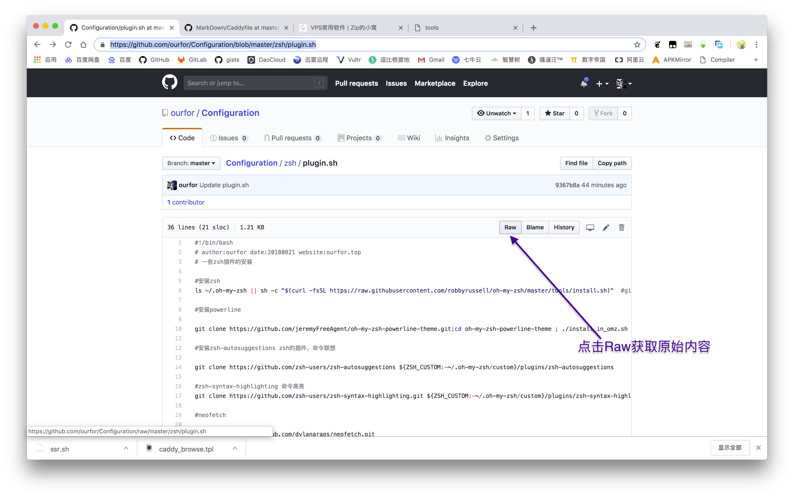
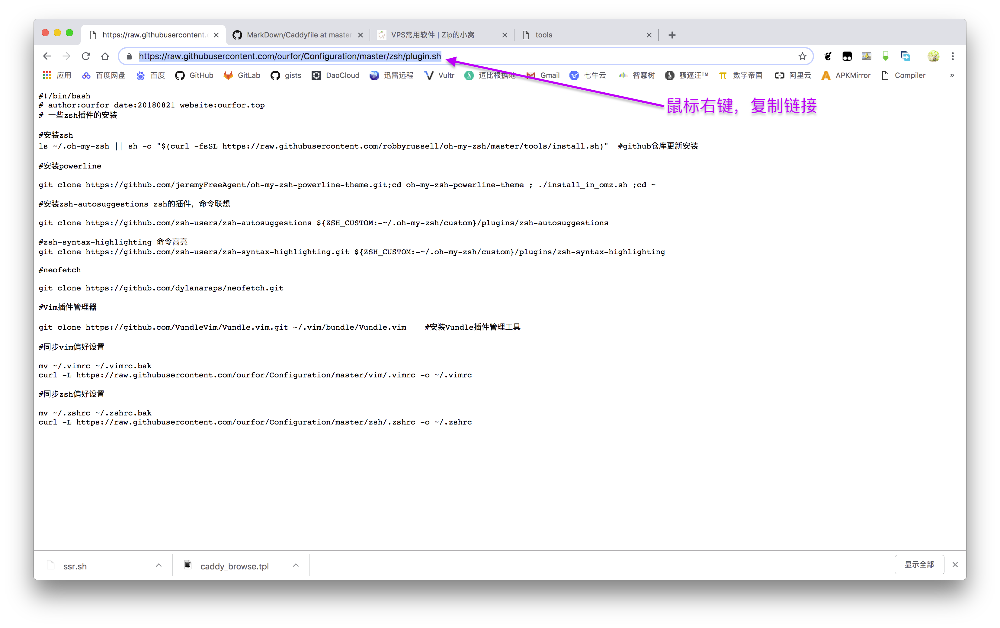

# Configuration
Saving all the preferance config file


# How to use those scripts

- Step 1


- Step 2 


- Step 3

Assume the URL you had copyed is ` url_of_targer_script `

if it is a script, do the following command：

```bash
sh -c "$(curl -fsSL url_of_targer_script)"
```

if it is a configure file, download it:
```bash
curl -L url_of_targer_script -o saving_location
```

` saving_location ` is the location of aiming file.
 
